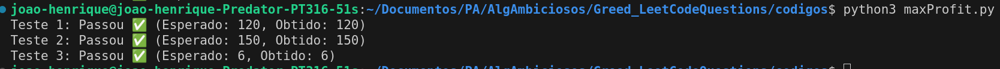
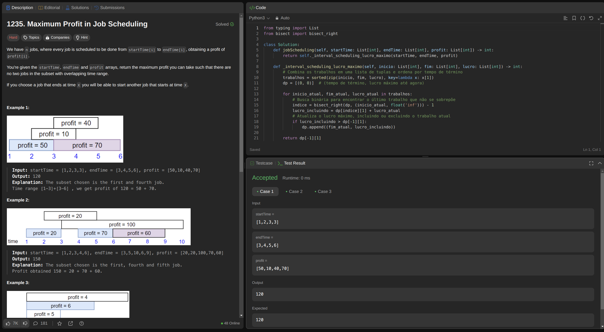
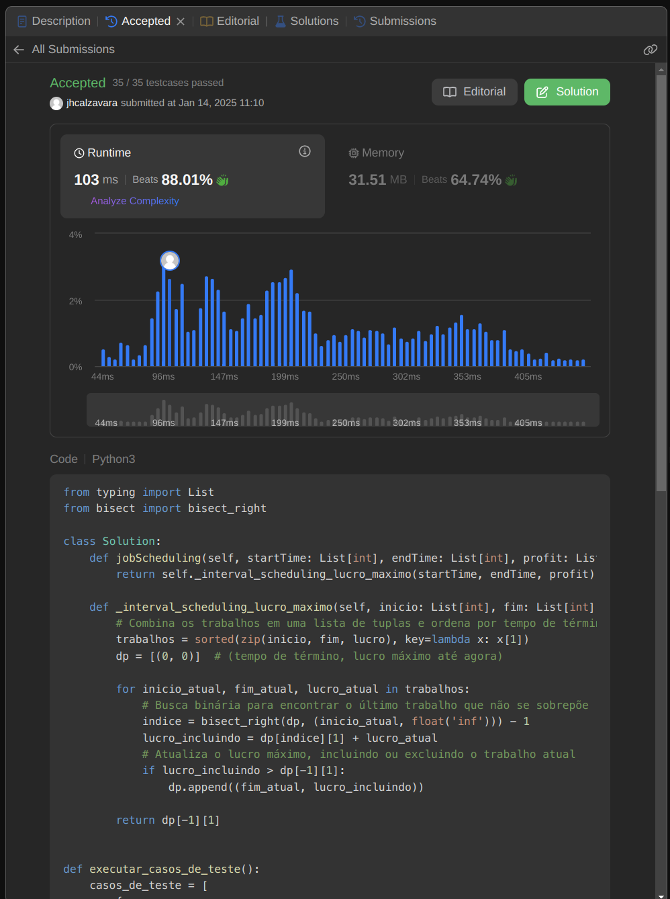
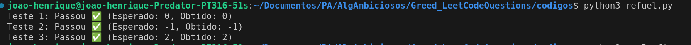
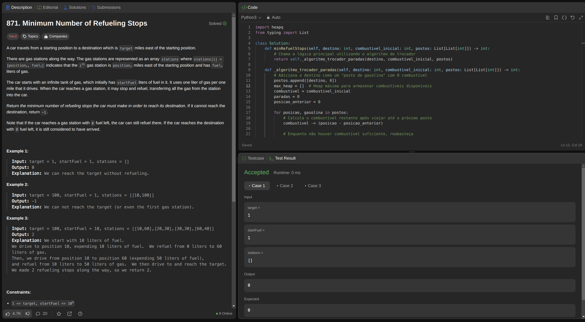
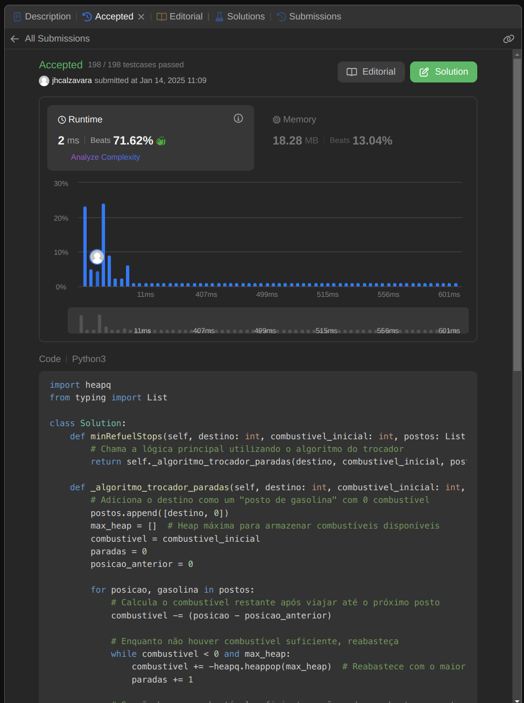
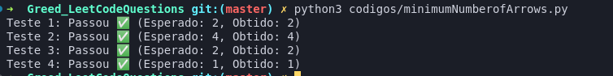
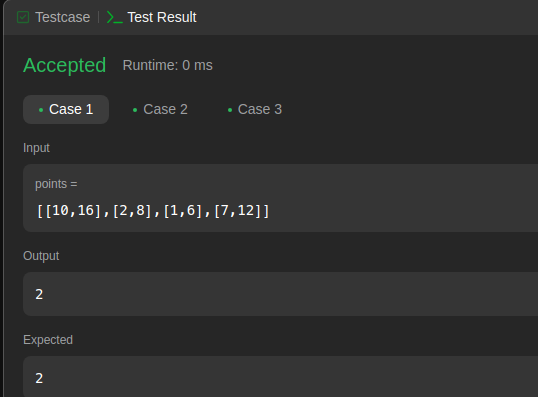
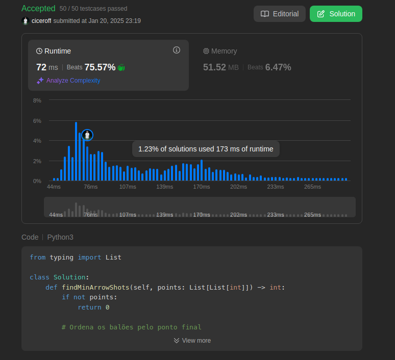

<!-- **!! Atenção: Renomeie o seu repositório para (Tema)_(NomeDoProjeto). !!** 

Temas:
 - Grafos1
 - Grafos2
 - PD
 - D&C
 - Greed
 - Final 
 
 **!! *Não coloque os nomes dos alunos no título do repositório*. Exemplo de título correto: Grafos2_Labirinto-do-Minotauro !!**
 
 (Apague essa seção) -->

# Leet Code Questions

**Número da Lista**: 7<br>
**Conteúdo da Disciplina**: Algoritmos ambiciosos (Greed)<br>

## Alunos
|Matrícula | Aluno |
| -- | -- |
| 19/0085819  |  Cicero Barrozo Fernandes Filho |
| 20/0067923  |  João Henrique Marques Calzavara |

## Sobre 

Este projeto tem como objetivo desenvolver questões sobre o conteúdo ministrado de **Algoritmos Ambiciosos**, com foco nos algoritmos **Interval Scheduling**, **Interval Partitioning**, **Scheduling to Minimize Lateness**, **Knapsack**, **Algoritmo do Trocador e do Caminhoneiro** e **Huffman Codes**. Para isso, serão elaboradas questões de média ou alta dificuldade, utilizando a plataforma de juíz online ***LeetCode***, que oferece uma vasta quantidade de desafios relacionados a esses temas.

## Questões

|Questão | Dificuldade | Código presente em:|
| -- | -- | -- |
| [1235. maximum-profit-in-job-scheduling](https://leetcode.com/problems/maximum-profit-in-job-scheduling/)  |  ***Difícil*** | [maxprofit.py](codigos/maxProfit.py) |
| [871. minimum-number-of-refueling-stops](https://leetcode.com/problems/minimum-number-of-refueling-stops/)  |  ***Difícil*** | [refuel.py](codigos/refuel.py) |
| [452. Minimum Number of Arrows to Burst Balloons](https://leetcode.com/problems/minimum-number-of-arrows-to-burst-balloons/description/)  |  ***Médio*** | [minimum.py](codigos/minimum.py) |


## Screenshots
<!-- Adicione 3 ou mais screenshots do projeto em funcionamento. -->
### maxprofit.py
- Rodando o arquivo python no terminal na pasta onde ele se encontra, após descomentar os testes no final do arquivo:
    - 
- Rodando o arquivo no ***Leet Code*** com seus testes passando:
    - 
- Submissão aceita no ***Leet code***:
    - 
<br>

### refuel.py
- Rodando o arquivo python no terminal na pasta onde ele se encontra, após descomentar os testes no final do arquivo:
    - 
- Rodando o arquivo no ***Leet Code*** com seus testes passando:
    - 
- Submissão aceita no ***Leet code***:
    - 
<br>

### minimum.py
- Rodando o arquivo python no terminal na pasta onde ele se encontra, após descomentar os testes no final do arquivo:
    - 
- Rodando o arquivo no ***Leet Code*** com seus testes passando:
    - 
- Submissão aceita no ***Leet code***:
    - 

## Instalação
**Linguagem**: Python<br>
<!-- **Framework**: (caso exista)<br>
Descreva os pré-requisitos para rodar o seu projeto e os comandos necessários. -->

## Uso 
<!-- Explique como usar seu projeto caso haja algum passo a passo após o comando de execução. -->
- Para rodar o projeto:
    - Faça o clone do repositório ou baixe o zip dele:
        - ```https://github.com/projeto-de-algoritmos-2024/Greed_LeetCodeQuestions.git```
    - Após ter a pasta do projeto, rode no terminal de sua máquina dentro da pasta ***Leet_Code_Questions***,  descomente a main que está comentada dos testes no final dos arquivos .py, e execute os seguintes comandos:
        - ```python3 maxProfit.py ```<br>
        - ```python3 refuel.py ```<br>
        - ```python3 minimum.py ```<br>

    - Para testar no ***leet code***:
        - Entre nos ***links*** presentes na tabela de questões, copie o código da questão que quer testar, e clique em ***run*** ou ***submit*** para testar os códigos ***(lembre de deixar os a main comentada para testar no leet code)***.

## Link para o vídeo 

<!-- Adicionar link para o vídeo -->
